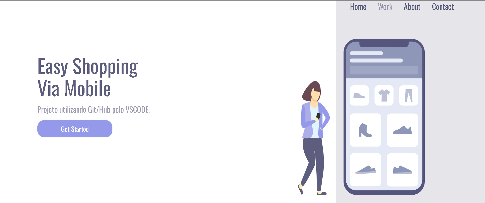

# 🛍️ Easy Shopping Via Mobile

<p align="center">
  
  
  
</p>


<p align="center">


</p>

---

# 📖 Sobre o projeto

O **Easy Shopping Via Mobile** é uma Landing Page desenvolvida com **HTML5** e **CSS3**, apresentando um layout moderno, elegante e totalmente responsivo.

O projeto foi desenvolvido para praticar conceitos fundamentais de Front-end, como estruturação semântica, Flexbox, responsividade e organização de código utilizando apenas HTML e CSS.

---

# ✨ Funcionalidades

- ✅ Layout moderno
- ✅ Navegação superior
- ✅ Botão de ação (Call To Action)
- ✅ Design responsivo
- ✅ Compatível com Desktop, Tablet e Smartphone
- ✅ Código organizado
- ✅ Utilização de Variáveis CSS
- ✅ Media Queries
- ✅ Flexbox

---

# 🚀 Tecnologias Utilizadas

<p align="center">


</p>

- HTML5
- CSS3
- Google Fonts
- Flexbox
- Media Queries
- CSS Variables
- Git
- GitHub

---

# 📂 Estrutura do Projeto

```text
📦 easy-shopping-via-mobile
│
├── img/
│   └── Illustration-3-3.png
│
├── index.html
├── style.css
└── README.md
